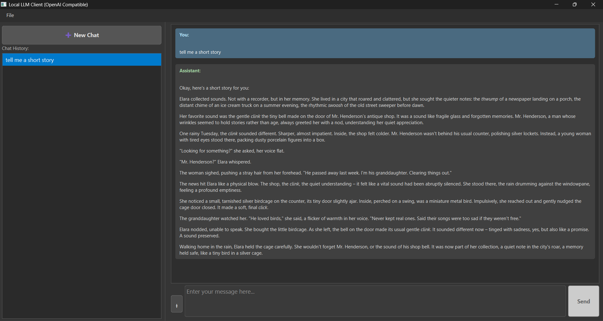

# PrivaChat: Local Multi-Modal Chat Client (via OpenAI-Compatible API)

## Overview

PrivaChat is a desktop application built with Python and PyQt6 that allows you to interact with Large Language Models (LLMs), such as Google's Gemini series, through an OpenAI-compatible API endpoint. It provides a user-friendly interface for text and multi-modal chat (including images, PDFs, and text files) while **keeping your chat history and API key stored securely and privately on your local machine.**

<!-- Optional: Add a screenshot here -->


## Features

*   **Chat Interface:** Clean and intuitive interface displaying user messages and model responses separately.
*   **API Integration:** Connects to OpenAI-compatible API endpoints (currently configured for Google's Generative Language API).
*   **Streaming Responses:** Model responses are displayed word-by-word as they are generated.
*   **Multi-Modal Input:** Attach Images (`.png`, `.jpg`, etc.), PDFs, and Text Files.
*   **Image Pasting:** Directly paste images from your clipboard.
*   **Private, Local Persistence:**
    *   Your entire chat history (text content and references to non-temporary attached files) is saved **only on your local computer** in an SQLite database (`chats.db`).
    *   No chat data is sent to any external servers, except for the necessary interaction with the specified LLM API during message generation.
    *   Chats persist between application sessions locally.
*   **Chat Management:** Create, switch between, and delete local chat sessions.
*   **Secure, Local API Key Handling:**
    *   Your API key is **never hardcoded** in the source code.
    *   It is stored **only on your local machine** within a `.env` file.
    *   This `.env` file should **never** be shared or committed to version control (like Git).
*   **Code Block Rendering:** Displays code snippets with a "Copy" button.
*   **"Thinking" Indicator:** Shows which model is processing your request.
*   **Dark Theme:** Comfortable dark UI.
*   **Configurable Model:** The LLM model can be changed in `openai_api.py`.

## Privacy and Local Data Handling

This application prioritizes keeping your data private and under your control:

*   **Chat History:** All conversation data, including your messages, the assistant's responses, and the file paths of your non-temporary attachments, are stored **exclusively** within the `chats.db` SQLite file located in the application's directory on your computer. This data **does not leave your machine**, except when being sent to the configured LLM API endpoint during an active request.
*   **API Key:** Your sensitive API key is stored in a `.env` file in the application's root directory. This file is read locally by the application and the key is used directly for API calls. **It is strongly recommended to add `.env` to your `.gitignore` file** to prevent accidental exposure if you use version control.
*   **Temporary Files:** Images pasted from the clipboard are saved as temporary files locally. These temporary files are automatically deleted after the message containing them is sent or when the application is closed.
*   **No External Servers (Beyond LLM API):** The application itself does not communicate with any third-party servers other than the LLM API endpoint you configure (e.g., Google's Generative Language API).

Essentially, your interactions and configuration remain on your own computer, offering a private environment for interacting with the LLM.

## Prerequisites

*   **Python:** Python 3.8 or newer is recommended.
*   **pip:** Python's package installer.
*   **Google API Key:** An API key from Google Cloud enabled for the **Generative Language API**. (Or an API key for another OpenAI-compatible service if you modify `openai_api.py`).

## Installation

1.  **Clone the Repository:**
    ```bash
    git clone https://github.com/resonancejb/privachat.git
    cd privachat
    ```

2.  **Create a Virtual Environment (Recommended):**
    ```bash
    # Windows
    python -m venv venv
    .\venv\Scripts\activate

    # macOS/Linux
    python3 -m venv venv
    source venv/bin/activate
    ```

3.  **Install Dependencies:**
    ```bash
    pip install -r requirements.txt
    ```

## Configuration

1.  **API Key Setup (Using `.env` file):**
    *   **Create the File:** In the main project directory (the same place `main.py` is located), create a file named exactly `.env`.
    *   **Add the Key:** Open the `.env` file with a text editor and add the following line, replacing `your_actual_google_api_key_here` with your real key:
        ```dotenv
        # Example for Google Generative Language API
        GOOGLE_API_KEY=your_actual_google_api_key_here

        # If using a different OpenAI-compatible service, you might use:
        # OPENAI_API_KEY=your_actual_openai_api_key_here
        ```
        *(Note: The application currently looks for `GOOGLE_API_KEY` by default, as configured in the code. You might need to adjust the code if using a different key variable name like `OPENAI_API_KEY`)*
    *   **Save the File.**
    *   **Security:** **Crucially, DO NOT commit this `.env` file to Git or share it.** Make sure `.env` is listed in your `.gitignore` file (as mentioned in the Installation section).
    *   **How the App Uses It:** The application uses the `python-dotenv` library to automatically load this key when it starts. If the `.env` file or the `GOOGLE_API_KEY` variable is missing, the application will fall back to prompting you for the key via the GUI (`File -> Settings`), and it will attempt to save it to the `.env` file for future use. You can always update the key directly in the `.env` file or via the Settings menu.

2.  **API Endpoint and Model (Advanced):**
    *   The `BASE_URL` for the OpenAI-compatible endpoint and the specific `MODEL_NAME` (like `gemini-1.5-flash-latest` or `gemini-1.5-pro-latest`) can be configured directly within the `openai_api.py` file if you need to change them from the defaults. Always consult the API provider's documentation (e.g., Google AI for Developers) for the correct values and model names.

## Understanding `.env` and API Key Security

Using a `.env` file is a standard practice for managing sensitive information like API keys securely and separately from your source code. Here's why and how it works in PrivaChat:

*   **What is `.env`?** It's a simple text file in the project's root directory containing key-value pairs (like `KEY=VALUE`). Comments can be added using `#`.
*   **What is `python-dotenv`?** It's a Python library (listed in `requirements.txt`) that reads the `.env` file and loads the variables defined inside it into the application's environment variables when the program starts.
*   **How PrivaChat uses it:**
    1.  When you run `python main.py`, near the beginning of the script, the `load_dotenv()` function from `python-dotenv` is called.
    2.  This function looks for a `.env` file in the current directory (or parent directories, depending on configuration).
    3.  If found, it reads lines like `GOOGLE_API_KEY=your_key` and makes `your_key` available to the Python script via `os.getenv('GOOGLE_API_KEY')`.
    4.  The rest of the application code can then securely access the API key using `os.getenv('GOOGLE_API_KEY')` without the key ever being written directly into the `.py` files.
*   **Why is this Secure?**
    *   **No Hardcoding:** Your secret key isn't embedded within the code that might be shared or publicly visible (like on GitHub).
    *   **Exclusion from Version Control:** By adding `.env` to your `.gitignore` file, you prevent accidentally uploading your secret key to platforms like GitHub. Each user running the code locally maintains their own private `.env` file.

This approach ensures your API key remains confidential on your local machine while allowing the application to function correctly.

## Running the Application

1.  Activate your virtual environment (if used):
    ```bash
    # Windows
    .\venv\Scripts\activate
    # macOS/Linux
    source venv/bin/activate
    ```
2.  Navigate to the project directory (`privachat`).
3.  Run:
    ```bash
    python main.py
    ```

## Usage Guide

1.  **Launch:** Run `python main.py`.
2.  **API Key:** Ensure your API key is configured in the `.env` file or enter it when prompted (it will be saved to `.env`).
3.  **Main Window:** The left pane lists your locally saved chats. The right pane shows the current chat conversation, attachment preview area, and message input box.
4.  **Managing Chats:** Click "➕ New Chat" to start a new conversation. Click a chat title in the left history panel to load it. Right-click a chat in the history list to rename or delete it locally. All chats are saved in the `chats.db` file in the application directory.
5.  **Sending Messages:** Type your message in the input box at the bottom. Press `Enter` to send. Use `Shift+Enter` to create a new line within the input box.
6.  **Attaching Files:** Click the `+ Attach File` button (or similar) to open a file dialog and select image files (`.png`, `.jpg`, `.jpeg`, `.gif`, `.bmp`, `.webp`), PDF files (`.pdf`), or plain text files (`.txt`).
7.  **Pasting Images:** Copy an image to your clipboard (e.g., using a screenshot tool or from a web browser) and paste it directly into the application (often by clicking in the chat area or input box and pressing `Ctrl+V` or `Cmd+V`). The image will appear in the attachment preview area.
8.  **Attachment Preview:** Attached files and pasted images appear below the message input box before sending. You can typically remove attachments from this preview area if needed. Attachments are processed locally and sent along with your text prompt to the LLM API. Paths for non-temporary files are stored locally in the database.
9.  **Getting Responses:** After sending, you'll see an indicator like "`<model_name>` is thinking...". The model's response will then stream into the chat window word by word.
10. **Code Blocks:** Code provided by the model is displayed in formatted blocks with syntax highlighting (if applicable) and a "Copy" button for convenience.
11. **Settings:** Access `File -> Settings` to view or update your locally stored API key (which updates the `.env` file).

## Technology Stack

*   **GUI:** PyQt6
*   **API Client:** OpenAI Python Library (`openai`)
*   **Configuration:** python-dotenv (`python-dotenv`)
*   **Database (Local):** SQLite3 (`sqlite3` - Python built-in)
*   **Image Handling:** Pillow (`Pillow`)
*   **PDF Handling:** PyMuPDF (`PyMuPDF`)
*   **Text Formatting (Display):** Markdown (`markdown`) - Used for rendering model responses.
*   **Syntax Highlighting (Code Blocks):** Pygments (`Pygments`) - Often used with Markdown rendering.

See `requirements.txt` for specific library versions.

## License

Distributed under the MIT License. See the `LICENSE` file for more information.
